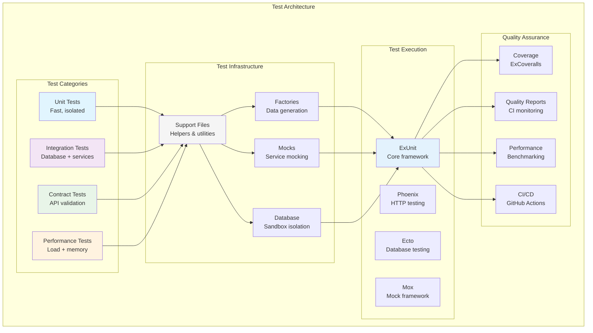

# Testing Architecture & Strategy

**WandererApp - Comprehensive Testing Framework**

---

## Executive Summary

Our testing architecture represents a sophisticated, production-ready testing framework that emphasizes performance, reliability, and automated quality assurance. The framework supports multiple test types with comprehensive coverage while maintaining fast execution times.

### Key Metrics
- **Comprehensive Test Coverage**: 85%+ overall coverage target
- **Test Categories**: Unit, Integration, Contract, Performance tests
- **Fast Execution**: Optimized for developer productivity
- **CI/CD Integration**: Automated quality gates and monitoring

---

## Architecture Overview



---

## Test Categories

### Test Pyramid Structure

```
        /\
       /  \     Performance Tests (5%)
      /____\    - Load testing
     /      \   - Memory profiling
    /        \  
   /          \ Contract Tests (10%)
  /____________\- API compliance
 /              \- External service contracts
/                \
\________________/
    Unit Tests (60%) + Integration Tests (25%)
    - Business logic      - Database operations
    - Pure functions      - API endpoints
    - Fast execution      - Service integration
```

### Category Details

| Category | Purpose | Coverage Target | Database | External Services |
|----------|---------|----------------|----------|------------------|
| **Unit** | Test individual functions/modules | 90%+ | No | Mocked |
| **Integration** | Test component interactions | 80%+ | Yes | Mocked/Stubbed |
| **Contract** | Validate API contracts | 100% | Yes | Real/Stubbed |
| **Performance** | Load and memory testing | Critical paths | Yes | Real/Mocked |

---

## Test Infrastructure

### Core Components

#### 1. Test Cases
- **DataCase**: Database-dependent tests with sandbox isolation
- **ConnCase**: HTTP request/response testing
- **ChannelCase**: WebSocket and real-time testing

#### 2. Factory System
- **ExMachina**: Data generation with configurable attributes
- **Sequences**: Unique data generation
- **Traits**: Common data variations
- **Associations**: Related data creation

#### 3. Mock Framework
- **Mox**: Explicit mocks for external services
- **Behavioral Testing**: Test interactions, not implementations
- **Concurrent Safe**: Thread-safe mock management

#### 4. Database Testing
- **Sandbox Isolation**: Each test runs in isolation
- **Transaction Rollback**: Automatic cleanup
- **Migration Testing**: Schema change validation

### Support Infrastructure

```
test/support/
├── api_case.ex              # API testing utilities
├── behaviours.ex            # Mock behavior definitions
├── data_case.ex             # Database test setup
├── mock_definitions.ex      # Mock configuration
├── mock_setup.ex            # Mock initialization
├── test_helpers.ex          # Common test utilities
├── test_optimization.ex     # Performance optimization
└── contract_helpers/        # Contract testing utilities
```

---

## Quality Assurance

### Coverage Requirements

| Component | Minimum Coverage | Target Coverage |
|-----------|------------------|----------------|
| **Business Logic** | 95% | 98% |
| **API Controllers** | 90% | 95% |
| **Database Operations** | 85% | 90% |
| **External Services** | 80% | 85% |
| **Overall Project** | 85% | 90% |

### Quality Gates

#### Pre-commit Hooks
- **Format Check**: Code formatting validation
- **Compile Check**: Compilation without warnings
- **Test Execution**: Fast test subset
- **Coverage Check**: Minimum coverage enforcement

#### CI/CD Pipeline
- **Unit Tests**: Fast feedback loop
- **Integration Tests**: Database and service testing
- **Contract Tests**: API specification validation
- **Performance Tests**: Regression detection
- **Coverage Reports**: Detailed coverage analysis

### Monitoring and Alerts

#### Test Health Metrics
- **Test Execution Time**: Track performance regression
- **Flaky Test Detection**: Identify unreliable tests
- **Coverage Trends**: Monitor coverage changes
- **Failure Patterns**: Analyze failure causes

#### Quality Dashboards
- **Real-time Status**: Current test health
- **Historical Trends**: Long-term quality metrics
- **Performance Metrics**: Execution time tracking
- **Coverage Reports**: Detailed coverage analysis

---

## Performance Architecture

### Test Execution Optimization

#### Parallel Execution
- **Async Tests**: Unit tests run in parallel
- **Database Isolation**: Sandbox prevents conflicts
- **Process Management**: Optimal resource utilization

#### Resource Management
- **Database Connections**: Pooled connections
- **Memory Management**: Efficient cleanup
- **External Services**: Mock optimization

### Performance Testing

#### Load Testing
- **Endpoint Testing**: API performance under load
- **Database Performance**: Query optimization validation
- **Memory Profiling**: Memory usage monitoring

#### Benchmarking
- **Baseline Establishment**: Performance benchmarks
- **Regression Detection**: Performance change alerts
- **Optimization Guidance**: Performance improvement recommendations

---

## CI/CD Integration

### GitHub Actions Workflow

```yaml
name: Test Suite
on: [push, pull_request]

jobs:
  test:
    runs-on: ubuntu-latest
    services:
      postgres:
        image: postgres:13
        env:
          POSTGRES_PASSWORD: postgres
        options: >-
          --health-cmd pg_isready
          --health-interval 10s
          --health-timeout 5s
          --health-retries 5
    
    steps:
      - uses: actions/checkout@v3
      
      - name: Setup Elixir
        uses: erlef/setup-beam@v1
        with:
          elixir-version: '1.14'
          otp-version: '25'
      
      - name: Install dependencies
        run: mix deps.get
      
      - name: Run tests
        run: mix test --cover
      
      - name: Upload coverage
        uses: codecov/codecov-action@v3
```

### Quality Gates

#### Automated Checks
- **Test Pass Rate**: 100% pass rate required
- **Coverage Thresholds**: Minimum coverage enforcement
- **Performance Regression**: Execution time monitoring
- **Code Quality**: Lint and format validation

#### Manual Reviews
- **Architecture Review**: Design and structure validation
- **Performance Review**: Critical path optimization
- **Security Review**: Vulnerability assessment

---

## Test Maintenance

### Automated Maintenance

#### Test Health Monitoring
- **Flaky Test Detection**: Automatic identification
- **Performance Monitoring**: Execution time tracking
- **Coverage Tracking**: Coverage change monitoring

#### Maintenance Tasks
- **Test Cleanup**: Remove obsolete tests
- **Performance Optimization**: Improve slow tests
- **Mock Updates**: Update external service mocks

### Manual Maintenance

#### Regular Reviews
- **Monthly Architecture Review**: System design validation
- **Quarterly Performance Review**: Optimization opportunities
- **Semi-annual Strategy Review**: Testing strategy updates

#### Continuous Improvement
- **Tool Evaluation**: New testing tools assessment
- **Process Optimization**: Workflow improvements
- **Team Training**: Skill development and best practices

---

## Development Workflow Integration

### Developer Experience

#### Local Development
- **Fast Feedback**: Quick test execution
- **Clear Diagnostics**: Detailed failure information
- **Easy Debugging**: Comprehensive error messages

#### IDE Integration
- **Test Runner**: Integrated test execution
- **Coverage Display**: Visual coverage indicators
- **Debugging Support**: Breakpoint and inspection

### Team Collaboration

#### Code Review Process
- **Test Coverage**: Coverage impact validation
- **Test Quality**: Test design and implementation review
- **Performance Impact**: Execution time consideration

#### Knowledge Sharing
- **Documentation**: Comprehensive testing guides
- **Training**: Regular testing workshops
- **Best Practices**: Shared testing patterns

---

## Future Enhancements

### Planned Improvements

#### Test Infrastructure
- **Property-Based Testing**: Expanded property testing
- **Mutation Testing**: Code quality validation
- **Visual Testing**: UI component testing

#### Performance Optimization
- **Parallel Database Testing**: Faster integration tests
- **Smart Test Selection**: Only run affected tests
- **Distributed Testing**: Cloud-based test execution

#### Quality Assurance
- **Advanced Analytics**: ML-based test insights
- **Predictive Analysis**: Failure prediction
- **Automated Optimization**: Self-optimizing tests

### Technology Evolution

#### Framework Updates
- **ExUnit Evolution**: Latest testing features
- **Phoenix Integration**: Enhanced web testing
- **Elixir Upgrades**: Language feature adoption

#### Tool Integration
- **Enhanced Mocking**: Advanced mock capabilities
- **Better Coverage**: More accurate coverage analysis
- **Performance Tools**: Advanced profiling integration

---

## Conclusion

Our testing architecture provides a robust foundation for maintaining high-quality software through comprehensive testing strategies. The combination of automated testing, performance monitoring, and continuous improvement ensures reliable software delivery while maintaining developer productivity.

### Key Strengths

1. **Comprehensive Coverage**: Multi-layered testing approach
2. **Performance Focus**: Optimized for fast feedback
3. **Quality Assurance**: Automated quality gates
4. **Maintainability**: Sustainable testing practices
5. **Developer Experience**: Streamlined workflows

### Success Metrics

- **Reliability**: High test pass rates and low flakiness
- **Performance**: Fast execution and quick feedback
- **Coverage**: Comprehensive code coverage
- **Maintainability**: Sustainable testing practices
- **Team Productivity**: Efficient development workflows

This architecture enables confident software delivery through reliable, fast, and comprehensive testing practices.

---

## References

- [TESTING_GUIDE.md](TESTING_GUIDE.md) - Complete testing guide
- [WORKFLOW.md](WORKFLOW.md) - Visual testing workflows
- [TROUBLESHOOTING.md](TROUBLESHOOTING.md) - Problem-solving guide
- [CONTRACT_TESTING_PLAN.md](CONTRACT_TESTING_PLAN.md) - API contract testing

---

*This architecture document is maintained by the development team and reviewed monthly for updates and improvements.*