# 🔄 Testing Workflow Guide

This guide provides visual workflows and step-by-step processes for effective testing in WandererApp.

## 📊 Testing Workflow Overview

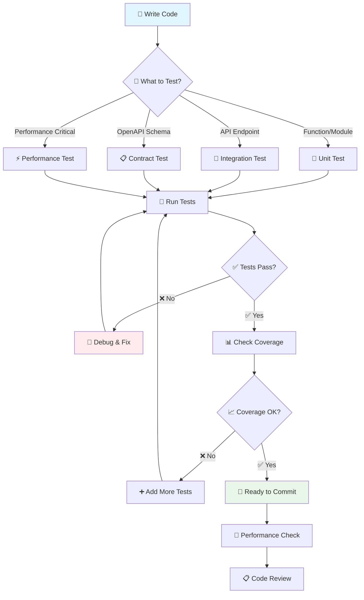

## 🎯 Test-Driven Development (TDD) Flow

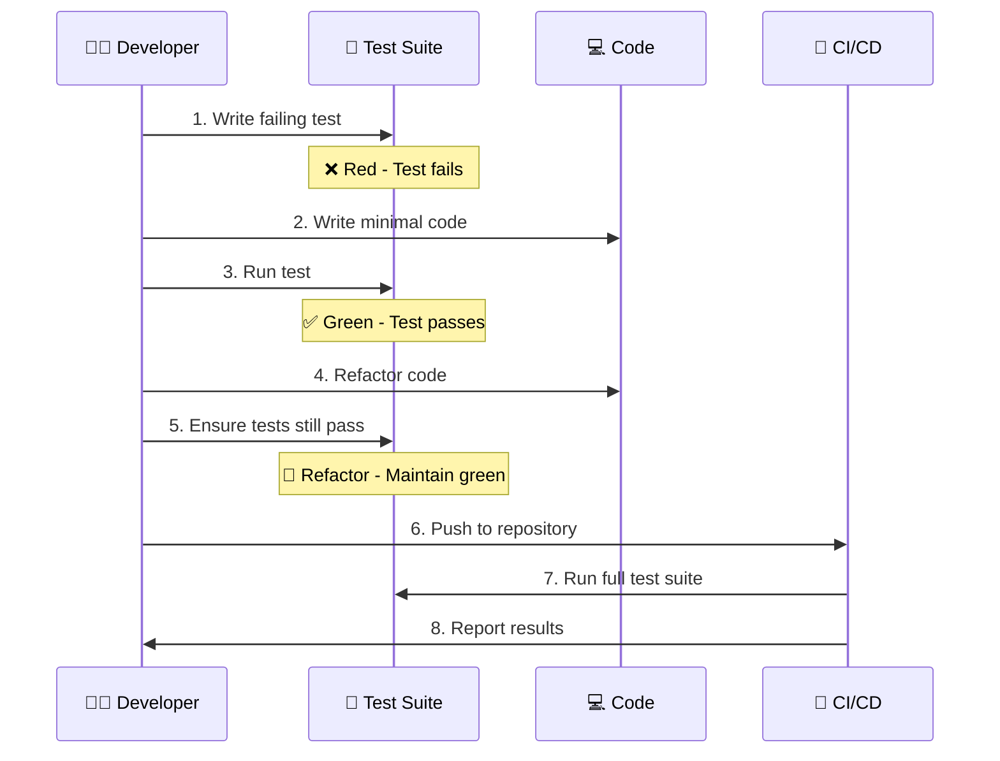

## 🏗️ Testing Strategy by Component

### 1. **API Development Workflow**

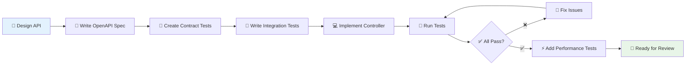

### 2. **Business Logic Development**

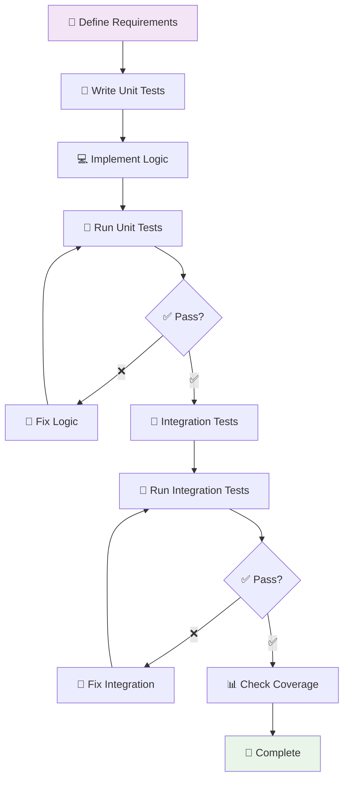

## 🧪 Test Creation Decision Tree

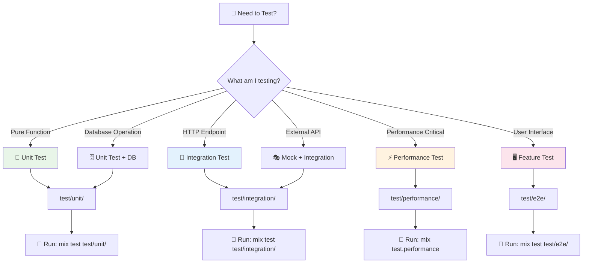

## 🔄 Continuous Testing Workflow

### Daily Development Cycle

```mermaid
gantt
    title Daily Testing Workflow
    dateFormat HH:mm
    axisFormat %H:%M
    
    section Morning
    Pull latest code      :done, pull, 09:00, 09:15
    Run full test suite   :done, test1, 09:15, 09:30
    Review test results   :done, review1, 09:30, 09:45
    
    section Development
    Write tests           :active, write1, 09:45, 11:00
    Implement feature     :active, impl1, 11:00, 12:30
    Run targeted tests    :test2, 12:30, 12:45
    
    section Integration
    Run integration tests :test3, 14:00, 14:30
    Performance check     :perf1, 14:30, 15:00
    Fix issues           :fix1, 15:00, 16:00
    
    section Completion
    Final test run       :test4, 16:00, 16:15
    Code review prep     :review2, 16:15, 16:30
```

### Pre-Commit Checklist Workflow

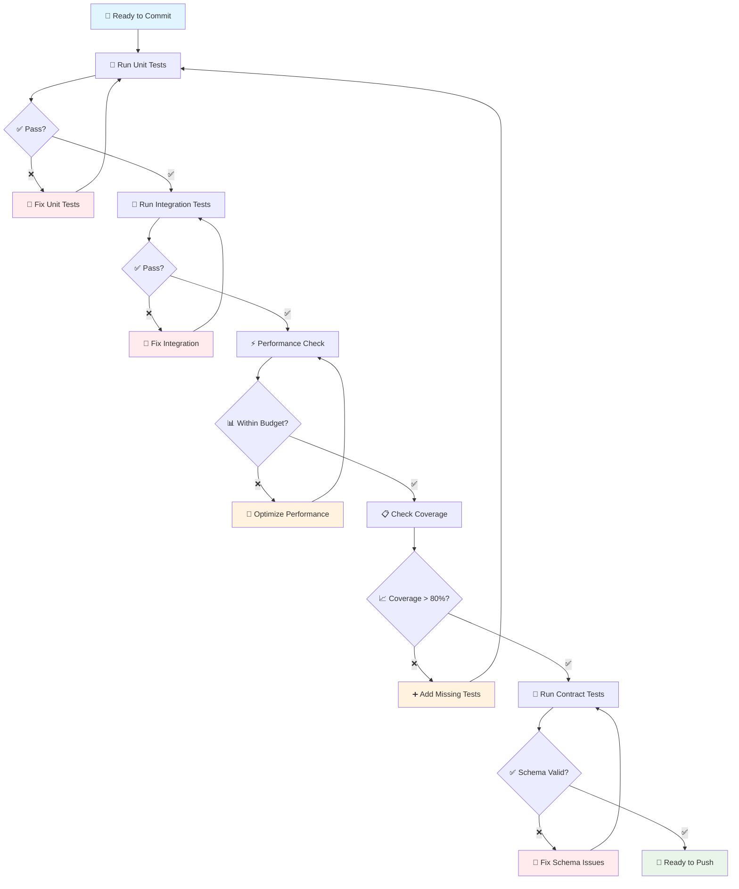

## 🏃‍♂️ Quick Testing Commands Reference

### Development Commands
```bash
# Quick test run during development
mix test --stale                    # Only run stale tests
mix test test/unit/my_test.exs:42   # Specific test line
mix test --failed                   # Only failed tests
```

### Performance Monitoring
```bash
# Enable performance monitoring
export PERFORMANCE_MONITORING=true

# Run with dashboard
mix test.performance --dashboard

# Performance budget check
mix test.performance --budget 1000
```

### Coverage and Quality
```bash
# Test coverage
mix test --cover

# Quality report
mix quality_report

# Test optimization
mix test_optimize
```

## 🎭 Testing Patterns by Scenario

### 1. **New Feature Development**

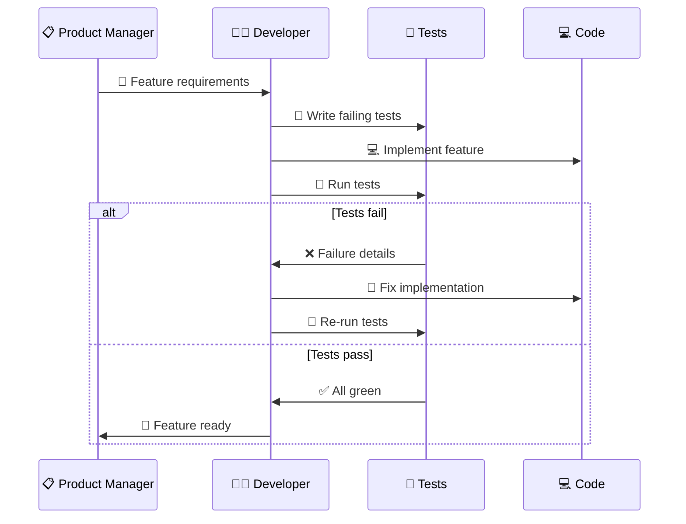

### 2. **Bug Fix Workflow**

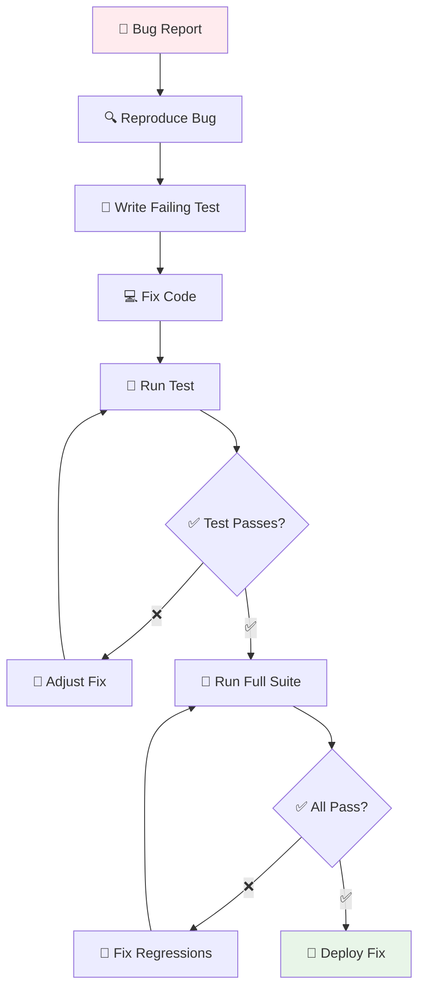

### 3. **Refactoring Workflow**

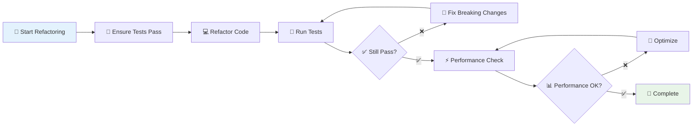

## 📊 Test Health Monitoring

### Test Suite Health Dashboard

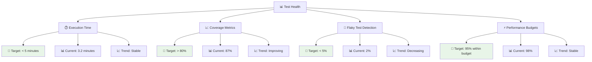

## 🚨 Troubleshooting Workflows

### When Tests Fail

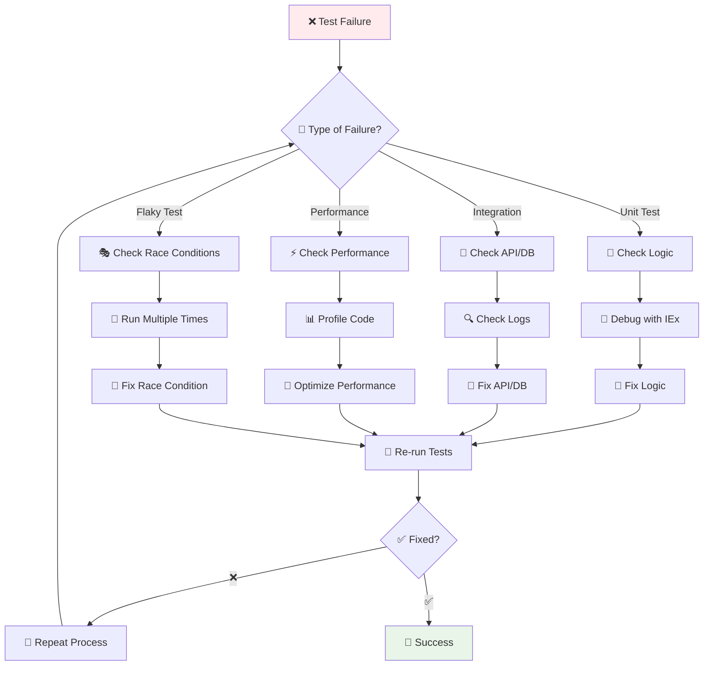

### Performance Issue Resolution

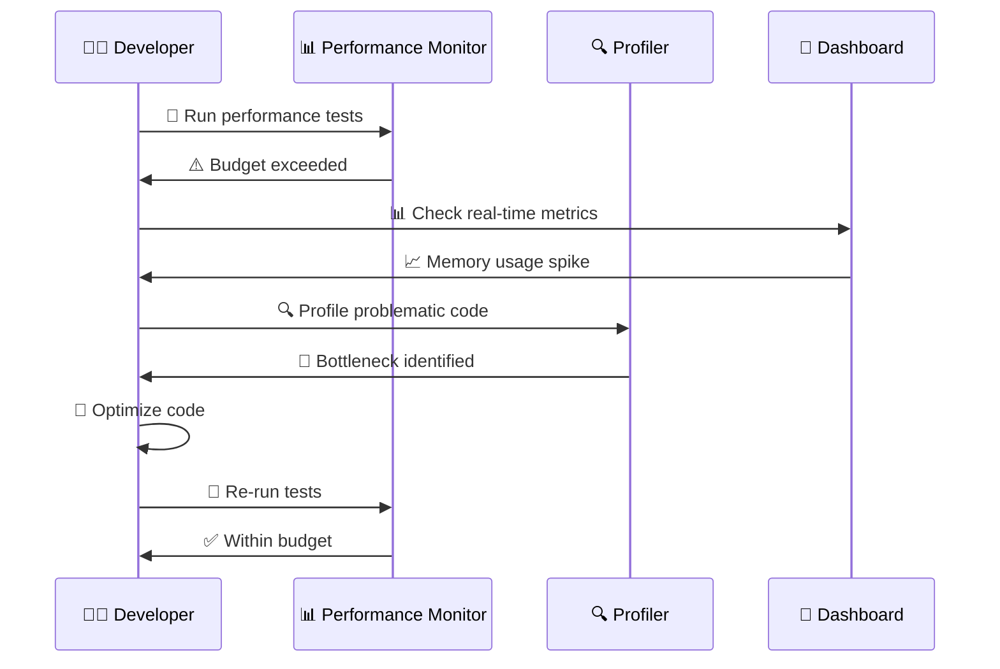

## 📚 Testing Best Practices Workflow

### Code Review Checklist

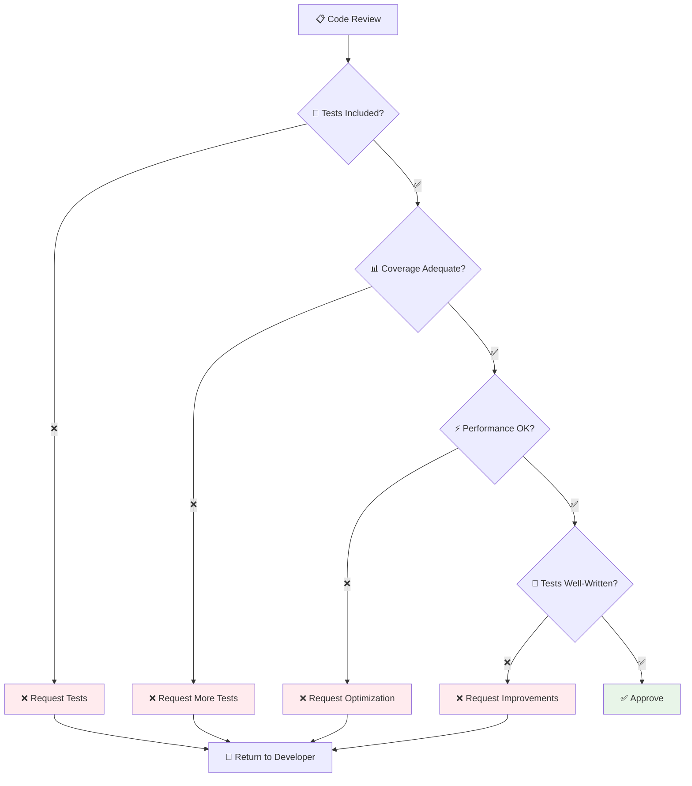

## 🎯 Success Metrics

Track these key metrics for testing health:

| Metric | Target | Current | Status |
|--------|--------|---------|---------|
| Test Execution Time | < 5 minutes | 3.2 minutes | ✅ |
| Code Coverage | > 80% | 87% | ✅ |
| Flaky Test Rate | < 5% | 2% | ✅ |
| Performance Budget Compliance | > 95% | 98% | ✅ |
| Test-to-Code Ratio | 2:1 | 2.3:1 | ✅ |
| Bug Escape Rate | < 10% | 6% | ✅ |

---

This workflow guide provides visual representations and step-by-step processes to help developers understand and follow effective testing practices in WandererApp.