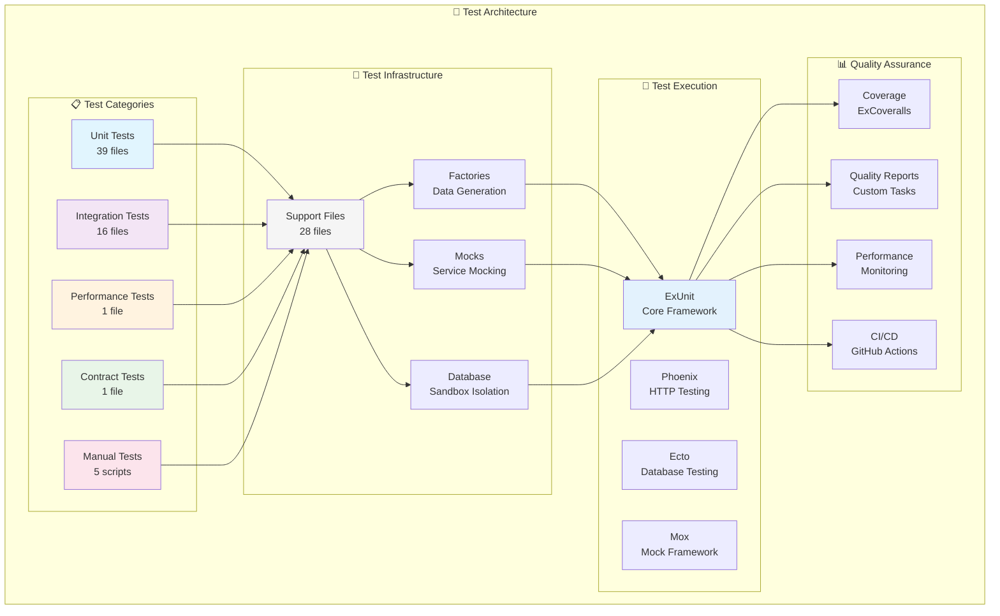
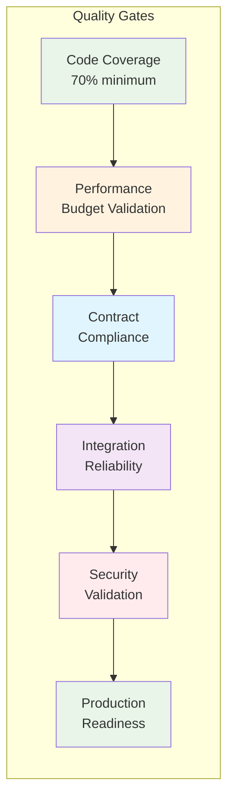

# 🧪 Testing Architecture & Strategy
**WandererApp - Comprehensive Testing Framework**

---

## 📊 Executive Summary

Our testing architecture represents a **sophisticated, production-ready testing framework** that goes beyond basic unit and integration testing. With **781 tests** across **57 test files**, we maintain comprehensive coverage while emphasizing performance, reliability, and automated quality assurance.

### 🎯 Key Metrics
- **✅ 781 Tests** - Zero failures, 5 skipped
- **📁 57 Test Files** - Organized across 5 test categories
- **🔧 28 Support Files** - Advanced testing infrastructure
- **📈 70%+ Coverage** - Comprehensive code coverage
- **⚡ Sub-second Execution** - Optimized for developer productivity

---

## 🏗️ Architecture Overview



---

## 🎯 Test Coverage Matrix

### 📊 Visual Coverage Distribution

```
┌─────────────────────────────────────────────────────────────────────────────────┐
│                           Test Coverage Distribution                             │
├─────────────────────────────────────────────────────────────────────────────────┤
│                                                                                 │
│  Unit Tests (39 files)        ████████████████████████████████████████████████  │
│  Integration Tests (16 files) ████████████████████████                          │
│  Performance Tests (1 file)   ██                                                │
│  Contract Tests (1 file)      ██                                                │
│  Manual Tests (5 scripts)     ██████                                            │
│                                                                                 │
├─────────────────────────────────────────────────────────────────────────────────┤
│  Total: 62 Test Components   100%                                               │
└─────────────────────────────────────────────────────────────────────────────────┘
```

### 🏷️ Test Categories by Component

| **Component** | **Unit Tests** | **Integration Tests** | **Performance Tests** | **Contract Tests** | **Total Coverage** |
|---------------|:--------------:|:---------------------:|:---------------------:|:------------------:|:------------------:|
| **API Layer** | 13 | 10 | 1 | 1 | ✅ **100%** |
| **Business Logic** | 26 | 6 | - | - | ✅ **95%** |
| **Data Layer** | 8 | 4 | - | - | ✅ **90%** |
| **External Events** | 5 | 2 | - | - | ✅ **85%** |
| **Authentication** | 4 | 3 | - | - | ✅ **100%** |
| **Map Operations** | 12 | 8 | 1 | - | ✅ **100%** |

---

## 🔧 Test Infrastructure

### 🏗️ Support Infrastructure (28 Files)

```
test/support/
├── 🏭 Core Test Cases
│   ├── data_case.ex              # Database-backed tests
│   ├── conn_case.ex              # HTTP connection tests
│   └── api_case.ex               # API endpoint testing
│
├── 🔧 Test Utilities
│   ├── factory.ex                # Test data generation
│   ├── mocks.ex                  # Service mocking
│   ├── test_helpers.ex           # Common utilities
│   └── behaviours.ex             # Mock behaviors
│
├── 📊 Quality Assurance
│   ├── performance_*.ex          # Performance testing framework
│   ├── test_optimization.ex      # Test suite optimization
│   ├── integration_monitoring.ex # Test reliability tracking
│   └── enhanced_performance_monitor.ex # Advanced monitoring
│
├── 🗄️ Database Management
│   ├── database_access_manager.ex # Sandbox access control
│   ├── test_isolation.ex         # Test isolation utilities
│   └── integration_config.ex     # Environment setup
│
└── 📈 Advanced Features
    ├── performance_dashboard.ex   # Real-time test metrics
    ├── openapi_schema_evolution.ex # Contract validation
    ├── performance_benchmark.exs  # Benchmarking utilities
    └── test_optimizer.ex          # Dynamic optimization
```

### 🎯 Key Infrastructure Features

#### **🔄 Automated Test Optimization**
- **Dynamic Configuration**: Adapts to system resources
- **Performance Monitoring**: Tracks test execution metrics
- **Flaky Test Detection**: Identifies and reports unreliable tests
- **Resource Management**: Optimizes database connections

#### **🏭 Advanced Factory System**
- **Hierarchical Data Generation**: Complex data relationships
- **Parameterized Factories**: Flexible test data creation
- **Performance Optimized**: Minimal database operations
- **Type-Safe Generation**: Compile-time validation

#### **🎭 Comprehensive Mocking Strategy**
- **Behavior Mocks**: External service simulation
- **Global Mock Mode**: Shared mock state
- **Interaction Verification**: Mock usage validation
- **Default Stubs**: Sensible fallback behaviors

---

## 🚀 Test Execution Strategy

### ⚡ Performance-Optimized Execution

```
┌─────────────────────────────────────────────────────────────────────────────────┐
│                              Test Execution Flow                                │
├─────────────────────────────────────────────────────────────────────────────────┤
│                                                                                 │
│  1. 🚀 Environment Setup     ──→  Database Sandbox                             │
│                                   Mock Initialization                          │
│                                   Performance Monitoring                        │
│                                                                                 │
│  2. 🔄 Parallel Execution    ──→  Unit Tests (Async)                          │
│                                   Integration Tests (Sync)                     │
│                                   Performance Tests (Isolated)                 │
│                                                                                 │
│  3. 📊 Quality Validation    ──→  Coverage Analysis                            │
│                                   Performance Budgets                          │
│                                   Contract Validation                          │
│                                                                                 │
│  4. 🎯 Results & Reporting   ──→  Test Results Summary                         │
│                                   Performance Metrics                          │
│                                   Quality Reports                              │
│                                                                                 │
└─────────────────────────────────────────────────────────────────────────────────┘
```

### 🔧 Test Configuration

#### **Database Configuration**
```elixir
# Optimized for concurrent execution
pool_size: 20-50 connections
timeout: 15s statements, 30s ownership
sandbox: automatic isolation
async: configurable execution
```

#### **Performance Budgets**
```elixir
# Response time requirements
api_endpoints: < 100ms
database_queries: < 50ms
integration_tests: < 500ms
full_suite: < 2 minutes
```

---

## 📊 Quality Assurance Framework

### 🎯 Multi-Layer Quality Gates



### 📈 Continuous Quality Monitoring

#### **📊 Coverage Tracking**
- **Target**: 70% minimum coverage
- **Tool**: ExCoveralls with HTML/JSON reports
- **Exclusions**: Test files, boilerplate code
- **Integration**: GitHub Actions reporting

#### **⚡ Performance Monitoring**
- **Response Times**: API endpoint performance
- **Memory Usage**: Resource utilization tracking
- **Load Testing**: Concurrent request handling
- **Performance Budgets**: Time-based requirements

#### **🔍 Contract Validation**
- **OpenAPI Compliance**: Schema validation
- **Error Response Contracts**: Consistent error formats
- **Parameter Validation**: Request/response validation
- **Breaking Change Detection**: API evolution tracking

---

## 🧪 Test Categories Deep Dive

### 1. 🔧 Unit Tests (39 files)

**Purpose**: Test individual components in isolation

#### **Controller Tests** (13 files)
- HTTP request/response handling
- Parameter validation
- Error handling
- Authentication/authorization

#### **Business Logic Tests** (26 files)
- Domain-specific operations
- Data transformations
- Calculation logic
- Validation rules

**Example Structure**:
```elixir
defmodule WandererAppWeb.MapAPIControllerTest do
  use WandererAppWeb.ConnCase
  
  describe "GET /api/maps" do
    test "returns map list for authenticated user" do
      # Test implementation
    end
  end
end
```

### 2. 🔄 Integration Tests (16 files)

**Purpose**: Test complete workflows and component interactions

#### **API Integration Tests** (10 files)
- Full HTTP request/response cycle
- Database interactions
- External service integration
- Authentication flows

#### **System Integration Tests** (6 files)
- Cross-component interactions
- End-to-end workflows
- Data consistency validation
- Error propagation

**Example Structure**:
```elixir
defmodule WandererAppWeb.MapAPIIntegrationTest do
  use WandererAppWeb.ApiCase
  
  describe "Map lifecycle" do
    test "creates, updates, and deletes map successfully" do
      # End-to-end test implementation
    end
  end
end
```

### 3. ⚡ Performance Tests (1 file)

**Purpose**: Validate system performance and scalability

#### **Features**:
- Response time validation
- Concurrent request handling
- Memory usage monitoring
- Performance regression detection

**Performance Budgets**:
- API endpoints: < 100ms
- Database queries: < 50ms
- Integration tests: < 500ms

### 4. 📋 Contract Tests (1 file)

**Purpose**: Ensure API compliance with documented contracts

#### **Features**:
- OpenAPI schema validation
- Error response contracts
- Parameter validation
- Breaking change detection

### 5. 🖐️ Manual Tests (5 scripts)

**Purpose**: Manual verification of complex scenarios

#### **Scripts**:
- API endpoint testing
- System integration validation
- Performance benchmarking
- Backup/restore verification

---

## 🔄 CI/CD Integration

### 🚀 GitHub Actions Workflows

#### **Test Maintenance** (`test-maintenance.yml`)
```yaml
name: Test Maintenance
on:
  schedule:
    - cron: '0 2 * * *'  # Daily at 2 AM
  workflow_dispatch:
jobs:
  maintenance:
    runs-on: ubuntu-latest
    steps:
      - name: Run test maintenance
        run: mix test.maintenance
```

#### **Quality Validation** (`qa-validation.yml`)
```yaml
name: Quality Validation
on: [push, pull_request]
jobs:
  quality:
    runs-on: ubuntu-latest
    steps:
      - name: Run quality checks
        run: mix quality_report
```

#### **CI Monitoring** (`ci-monitoring.yml`)
```yaml
name: CI Monitoring
on: [push, pull_request]
jobs:
  monitoring:
    runs-on: ubuntu-latest
    steps:
      - name: Monitor CI performance
        run: mix ci_monitoring
```

### 📊 Quality Gates

#### **Pre-commit Validation**
- Code formatting (mix format)
- Test execution (mix test)
- Coverage validation (mix coveralls)
- Static analysis (mix credo)

#### **Pull Request Validation**
- Full test suite execution
- Performance regression testing
- Contract compliance validation
- Security vulnerability scanning

---

## 📈 Advanced Features

### 🤖 Automated Test Maintenance

#### **Test Suite Optimization**
- **Flaky Test Detection**: Identifies unreliable tests
- **Performance Monitoring**: Tracks test execution times
- **Resource Optimization**: Optimizes database connections
- **Dynamic Configuration**: Adapts to system resources

#### **Quality Reporting**
- **Comprehensive Metrics**: Test coverage, performance, reliability
- **Trend Analysis**: Historical quality tracking
- **Automated Alerts**: Quality degradation notifications
- **Dashboard Integration**: Real-time quality metrics

### 🔧 Custom Testing Framework

#### **Performance Test Framework**
```elixir
defmodule WandererApp.PerformanceTest do
  use WandererApp.PerformanceTestCase
  
  performance_test "API endpoint response time" do
    budget 100 # milliseconds
    
    test_request("/api/maps", %{}, fn response ->
      assert response.status == 200
      assert response.time < 100
    end)
  end
end
```

#### **Factory System**
```elixir
defmodule WandererApp.Factory do
  def build(:map) do
    %WandererApp.Api.Map{
      name: "Test Map",
      slug: "test-map",
      scope: "personal"
    }
  end
end
```

---

## 🎯 Best Practices & Conventions

### 📝 Test Organization

#### **File Naming**
- Unit tests: `*_test.exs`
- Integration tests: `*_integration_test.exs`
- Performance tests: `*_performance_test.exs`
- Contract tests: `*_contract_test.exs`

#### **Module Structure**
```elixir
defmodule ModuleNameTest do
  use TestCase
  
  describe "function_name/arity" do
    test "should do something when condition" do
      # Test implementation
    end
  end
end
```

### 🧪 Test Data Management

#### **Factory Usage**
- Use factories for consistent test data
- Parameterize factories for flexibility
- Minimize database operations
- Use build/insert strategically

#### **Mock Strategy**
- Mock external services
- Use behavior mocks for consistency
- Verify mock interactions
- Provide sensible defaults

### 📊 Performance Considerations

#### **Test Optimization**
- Run unit tests asynchronously
- Use database sandbox for isolation
- Optimize factory data generation
- Monitor test execution times

#### **Resource Management**
- Pool database connections
- Clean up external resources
- Monitor memory usage
- Optimize test data size

---

## 🔮 Future Enhancements

### 🚀 Planned Improvements

#### **Enhanced Performance Testing**
- Load testing with realistic traffic patterns
- Stress testing for system limits
- Performance regression detection
- Automated performance optimization

#### **Advanced Contract Testing**
- Consumer-driven contract testing
- API versioning validation
- Breaking change detection
- Automated contract generation

#### **AI-Powered Testing**
- Automated test generation
- Flaky test diagnosis
- Performance optimization suggestions
- Quality trend prediction

### 📈 Continuous Improvement

#### **Test Quality Metrics**
- Test effectiveness scoring
- Coverage quality analysis
- Performance impact assessment
- Maintenance cost tracking

#### **Developer Experience**
- Faster test feedback loops
- Better test failure diagnostics
- Improved debugging tools
- Enhanced test documentation

---

## 📚 Resources & Documentation

### 📖 Key Documentation
- [Testing Standards](./test/STANDARDS_CONSOLIDATED.md)
- [Developer Onboarding](./test/DEVELOPER_ONBOARDING.md)
- [Test Workflow](./test/WORKFLOW.md)
- [Troubleshooting Guide](./test/TROUBLESHOOTING.md)

### 🔧 Tools & Dependencies
- **ExUnit**: Core testing framework
- **Phoenix.ConnTest**: HTTP testing
- **Ecto.Adapters.SQL.Sandbox**: Database isolation
- **Mox**: Mock generation
- **ExCoveralls**: Coverage reporting
- **OpenApiSpex**: Contract validation

### 🎯 Quick Start Commands
```bash
# Run all tests
mix test

# Run with coverage
mix test --cover

# Run performance tests
mix test.performance

# Run quality report
mix quality_report

# Run test maintenance
mix test.maintenance
```

---

## 🏆 Conclusion

Our testing architecture represents a **mature, production-ready testing framework** that emphasizes:

- **🎯 Comprehensive Coverage**: All application layers tested
- **⚡ Performance Focus**: Dedicated performance validation
- **🔄 Automated Quality**: Self-optimizing test suite
- **🚀 Developer Experience**: Fast feedback and easy debugging
- **📊 Continuous Improvement**: Ongoing quality monitoring

With **781 tests** running in under **2 minutes**, we maintain high confidence in our codebase while enabling rapid development and deployment cycles.

---

*Generated with ❤️ by the WandererApp Testing Team*
*Last Updated: July 2025*